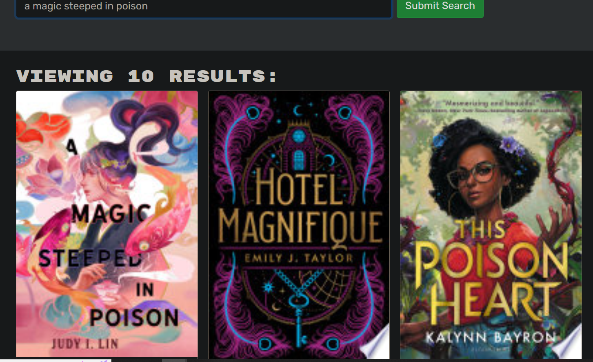
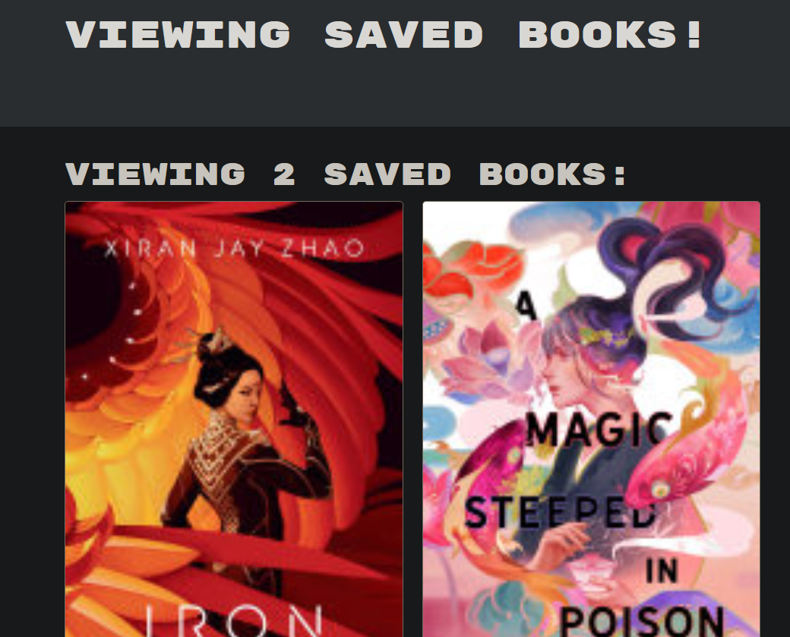

# Book Search

## Description

### Technology
- MongoDB
- Express.js
- React
- Node.js
- GraphQL
- Apollo Server
- JSON web tokens (JWT)

## Installation Instructions
```
npm i
```

## Usage Instructions
On the deployed app, make sure to first create an account if you have not already done so. Once you are logged in, search for a book in the provided search bar. A list of results will appear below that includes an image of the book's cover as well as a description below. At the bottom of the description, if you are logged in, there will be a button that allows a user to add that book to a list of their saved books. If the book is already saved, the button will tell you so. 

To view your list of saved books, click the "See Your Books" link on the top right of the page. Here you can delete books from the list. 

[Click here for the deployed app.](https://book-search-engine-mern-rd.herokuapp.com/)

### Screenshots





## License
This project is MIT licensed.

## Contact
